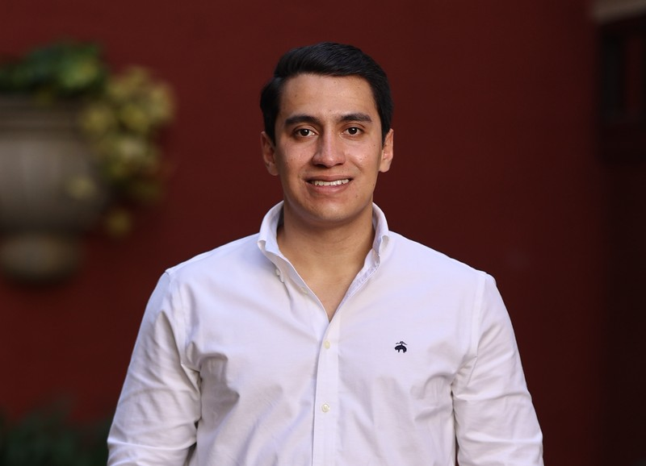
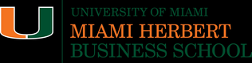

::: {.section-container}

::: {.about-header}

{alt="Daniel Regalado"}

::: {.about-header-text}

# Daniel Regalado Cardoso

::: {.bio}
Data Scientist and AI/ML Engineer based in Miami, originally from **Guatemala**. I work at the intersection of data science, business strategy, and AI engineering — building LLM applications, multi-agent systems, and predictive analytics solutions.

Currently pursuing my **MS in Business Analytics** at the University of Miami Herbert Business School (GPA 3.9/4.0). I also hold an MS in Energy Business Management and a BS in Chemical Industrial Engineering from **Universidad del Valle de Guatemala**.

Fluent in English and Spanish, with experience at **CBC (PepsiCo bottler)**, **AB InBev**, **Spectrum**, and collaborations with **UHealth Bascom Palmer Eye Institute** and **Deloitte**.
:::

:::

:::

:::

::: {.section-container}

## Skills & Tools {.section-title}

::: {.section-subtitle}
What I work with.
:::

::: {.skills-grid}

::: {.skill-card}
::: {.skill-icon}
🧠
:::

#### AI & Machine Learning

LLMs, RAG, Multi-Agent Systems, Deep Learning, NLP, SHAP, CatBoost, XGBoost, LSTM, Time Series
:::

::: {.skill-card}
::: {.skill-icon}
🔗
:::

#### LLM Engineering

LangChain, LangGraph, OpenAI API, Anthropic Claude, ChromaDB, LangSmith, MCP, Prompt Engineering
:::

::: {.skill-card}
::: {.skill-icon}
💻
:::

#### Programming & Data

Python, SQL, R, Snowflake, Databricks, Pandas, Scikit-learn, PyTorch, NumPy
:::

::: {.skill-card}
::: {.skill-icon}
📊
:::

#### Visualization & BI

Power BI, Tableau, Plotly, Matplotlib, Advanced Excel, Streamlit, A/B Testing
:::

::: {.skill-card}
::: {.skill-icon}
☁️
:::

#### Cloud & DevOps

GCP, Docker, Git, GitHub Actions, Railway, Azure, MLflow, Hugging Face, n8n
:::

::: {.skill-card}
::: {.skill-icon}
🌐
:::

#### Languages

English (Fluent) · Spanish (Native)
:::

:::

:::

::: {.section-container}

## Experience {.section-title}

::: {.section-subtitle}
Where I've worked.
:::

::: {.timeline}

::: {.timeline-item}
#### The Central America Bottling Corp (CBC)
**Commercial Assets Analyst** · Jul 2024 – Jan 2025

Managed end-to-end strategy for commercial assets, including returnable bottles and refrigeration equipment, improving sales performance and operational efficiency. Built advanced dashboards and automated reporting to monitor asset performance and support data-driven product launch decisions. Developed customer segmentation and credit optimization strategies to improve asset allocation across key retail markets.
:::

::: {.timeline-item}
#### The Central America Bottling Corp (CBC)
**Trade Marketing Administrative** · May 2023 – Jun 2024

Oversaw and executed a $5.2M+ Trade Marketing budget, aligning OPEX and CAPEX with commercial priorities. Built performance dashboards to track KPIs and optimize marketing resource allocation across retail channels.
:::

::: {.timeline-item}
#### The Central America Bottling Corp (CBC)
**Commercial Processes Intern** · Feb 2023 – Apr 2023

Developed KPI dashboards for the global World Class Sales program, enabling real-time sales performance visibility.
:::

::: {.timeline-item}
#### Spectrum
**Market Analysis Executive** · Aug 2022 – Jan 2023

Conducted market research and statistical analysis for the energy sector. Produced executive reports and data-driven recommendations to guide strategic decisions.
:::

::: {.timeline-item}
#### Ambev Central America (AB InBev)
**Revenue Intern** · Jan 2022 – Jul 2022

Built predictive models and automated dashboards for pricing optimization and competitor tracking across national markets. Supported revenue management strategies.
:::

:::

:::

::: {.section-container}

## Education {.section-title}

::: {.education-grid}

::: {.edu-card}
{.edu-logo alt="University of Miami"}

::: {.degree}
MS Business Analytics
:::
::: {.school}
University of Miami — Herbert Business School
:::
::: {.year}
2025 – 2026
:::
::: {.gpa}
GPA: 3.9/4.0
:::
:::

::: {.edu-card}
{.edu-logo alt="Universidad del Valle de Guatemala"}

::: {.degree}
MS Energy Business Management
:::
::: {.school}
Universidad del Valle de Guatemala
:::
::: {.year}
2024 – 2025
:::
::: {.gpa}
Ranked 2nd of 16 graduates
:::
:::

::: {.edu-card}
{.edu-logo alt="Universidad del Valle de Guatemala"}

::: {.degree}
BS Chemical Industrial Engineering
:::
::: {.school}
Universidad del Valle de Guatemala
:::
::: {.year}
2018 – 2023
:::
:::

:::

:::

::: {.section-container}

## Certifications {.section-title}

#### AI & Machine Learning

::: {.cert-list}

::: {.cert-item}
 &nbsp; **Neural Networks and Deep Learning** — DeepLearning.AI
:::

::: {.cert-item}
 &nbsp; **MCP: Build Rich-Context AI Apps with Anthropic** — DeepLearning.AI
:::

::: {.cert-item}
 &nbsp; **Introduction to LangChain (Python)** — LangChain
:::

::: {.cert-item}
 &nbsp; **Developing AI Applications** — DataCamp
:::

::: {.cert-item}
 &nbsp; **Multi-Agent Systems with LangGraph** — DataCamp
:::

::: {.cert-item}
 &nbsp; **Developing Applications with LangChain** — DataCamp
:::

::: {.cert-item}
 &nbsp; **Prompt Engineering with the OpenAI API** — DataCamp
:::

::: {.cert-item}
 &nbsp; **Introduction to Embeddings with the OpenAI API** — DataCamp
:::

::: {.cert-item}
 &nbsp; **Working with Hugging Face** — DataCamp
:::

::: {.cert-item}
 &nbsp; **LLMOps Concepts** — DataCamp
:::

::: {.cert-item}
 &nbsp; **AI Ethics** — DataCamp
:::

:::

#### Data & Cloud

::: {.cert-list}

::: {.cert-item}
 &nbsp; **GitHub Foundations** — DataCamp
:::

::: {.cert-item}
 &nbsp; **Snowflake Foundations** — DataCamp
:::

::: {.cert-item}
 &nbsp; **Intermediate SQL** — DataCamp
:::

::: {.cert-item}
 &nbsp; **Data Analytics in Power BI** — Coursera
:::

::: {.cert-item}
 &nbsp; **Statistical Methods for Six Sigma with R** — UVG
:::

::: {.cert-item}
 &nbsp; **Excel/VBA for Creative Problem Solving** — University of Colorado
:::

:::

#### Business & Strategy

::: {.cert-list}

::: {.cert-item}
 &nbsp; **Business Growth Strategy** — UVA Darden School of Business
:::

::: {.cert-item}
 &nbsp; **Advanced Business Strategy** — UVA Darden School of Business
:::

::: {.cert-item}
 &nbsp; **Retail Marketing Strategy** — Wharton Online
:::

::: {.cert-item}
 &nbsp; **Data-Driven Process Improvement** — University at Buffalo
:::

::: {.cert-item}
 &nbsp; **ISO 50001 Internal Auditor** — SGS
:::

::: {.cert-item}
 &nbsp; **Scrum Fundamentals Certified** — VMEdu
:::

:::

:::

::: {.section-container}

::: {.connect-section}

::: {.connect-heading}
Let's connect.
:::

I'm actively looking for opportunities in Data Science, AI/ML Engineering, and Business Analytics.

::: {.connect-links}
[ LinkedIn](https://www.linkedin.com/in/daniel-regalado-cardoso-81551b16b){.btn .btn-primary .btn-lg target="_blank"}
[ dxr1491@miami.edu](mailto:dxr1491@miami.edu){.btn .btn-outline-primary .btn-lg target="_blank"}
:::

:::

:::
